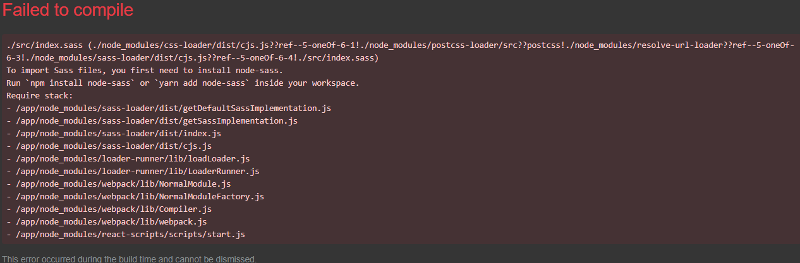

# Team Project 2021 - Team 18

The goal of this project is to create software for a restaurant that will drastically improve the speed required when training new recruits.


## How To Use

Once you have started the docker container using the provided tools and commands below you will need to navigate to [http://localhost:8000](http://localhost:8000).

### Dependancies

You will need to install:

- [Docker](https://docs.docker.com/get-docker/)
- [Node.JS / NPM](https://nodejs.org/en/download/)

Once installed, navigate to your cloned directory and run

### Using our App

To run this application run the following commands

- `cd` into the downloaded directory
- `npm run docker:up` to run the container

### App Pages

After starting the app using information provided in [Using our App](#using-our-app) section, click the following links to open a specific page you want to go to:

- [Menu](http://localhost:8000/) - Order from the menu
- [Order Confirmation](http://localhost:8000/order_confirm/2) - Order confirmation page for the customer
- [Kitchen Orders](http://localhost:8000/kitchen) - Informs kitchen what orders need to be cooked
- [Waiter Orders](http://localhost:8000/waiter) - Informs waiters what orders need to be delivered
- [Waiter Menu Items](http://localhost:8000/waiter/items) - Allows waiters to make menu items available/unavailable
- [Waiter Order States](http://localhost:8000/waiter/orders) - Allows waiters to change the order status of orders
- [Manager Menu Items](http://localhost:8000/manager) - Allows managers to manage menu items
- [404](http://localhost:8000/abcdefghijklmnopqrstuvwxyz) - Page loads when unknown url is used

### Documentation

_You will need to run `npm i` in the `/api` and `/app` folders if you encounter any errors._

**The API and App Documentation are different**

You can generate all our documentation at the same time by running

```
npm run docs:all
```

This will generate API documentation and start a local server for App documentation.
To view the API documentation **you will need to open `/api/docs/index.html` in your browser**.

#### API


To view our API's documentation you first have to create it using:

```
npm run docs:api
```

Once run navigate to the documentation in `./api/docs/` and open `index.html` in your browser.

**After starting the app using information provided in [Using our App](#using-our-app) section, you can use the in built sample requests to see results of each API request using our documentation.**

#### App


To view our App's component documentation you can spin up the Storybook server using:

```
npm run docs:app
```

_You may need to run `npm i` at root (`/`) and `/api` to install all necessary dependancies._

### Testing

#### API


To test the API run the following at root:

```
npm run test:api
```

_You may need to run `npm i` at root (`/`) and `/api` to install all necessary dependancies._

##### `ECONNREFUSED` errors

Most of the time the testing will run however sometimes docker doesn't have enough time to fully initialise and start the testing container.

Because of this, running the following commnads (with a delay between them) solves this issue:

- `npm run test:api:setup` - Set's up the testing db
- `npm run test:api:mocha` - Runs the test

### All Docker Commands

_These commands will need to be run at root._

Starts Docker containers and networks (_runs detached_):
_`docker:up` will build first if no build exists_

```
npm run docker:up
```

Starts Docker containers and networks (_runs atached_):

```
npm run docker:up:attached
```

Builds Docker images from a docker-compose.yml, Dockerfile and "context";

```
npm run docker:build
```

Stops Docker containers and networks:

```
npm run docker:down
```

Stops Docker containers and networks and removes volumes:

```
docker:down:volumes
```

### Access to PgAdmin4

- **URL:** [http://localhost:5050](http://localhost:5050)
- **Username:** `pgadmin4@pgadmin.org`
- **Password:** `admin`

#### Add a new server in PgAdmin4

- **Host name/address** `team18_db`
- **Port** `5432`
- **Username** `team18`
- **Password** `root`

## Debugging

### General Fixes

Most problems can be resolved by running the following commands:

1. `npm run docker:down:volumes` (Turns off containers)
1. `rm -rf db/data` [**On Windows** `rmdir db/data`]
   1. _If your issue does solve, try restarting your computer here_
1. `npm run docker:build` (Rebuilds your containers)
1. `npm run docker:up` (Turns on containers)

This will remove and delete all containers from the docker environment, creating a new clean install of the app.

### Missing Packages


To resolve this issue you will need to do run the following commands:

1. `cd app` (or API if the package is missing from the API)
1. `npm i --save PACKAGE_NAME` (PACKAGE_NAME is specified in the error such as `@fortawesome/free-solid-svg-icons` in the example image above)
1. `cd ..` (Returns to root directory)
1. `npm run docker:down` (Turns off containers)
1. `npm run docker:build` (Rebuilds your containers)
1. `npm run docker:up` (Turns on containers)

This holds true for any missing package such as:

- `@fortawesome/free-solid-svg-icons`
- `@fortawesome/react-fontawesome`
- `axios`
- etc...

### To Import Sass Files you First Need to Install `node-sass`



To resolve this issue you will need to do run the following commands:

1. `cd app`
1. `npm i --save node-sass@4.14.1`
1. `cd ..`
1. `npm run docker:down` (Turns off containers)
1. `npm run docker:build` (Rebuilds your containers)
1. `npm run docker:up` (Turns on containers)

### Docker Hasn't Started


To resolve this issue you need to run the Docker on your local machine.

### Unable to Resolve Dependency Tree

To resolve the error `npm ERR! ERESOLVE unable to resolve dependency tree`.
Open the offending directory with `cd` and run the following:

```
npm install --save --legacy-peer-deps
```

### HTTP Request Took Too Long to Complete

If you get the error `ERROR: An HTTP request took too long to complete. Retry with --verbose to obtain debug information.`.
You can try bypassing this issue by running build before up, i.e.:

- `npm run docker:build`
- `npm run docker:up`

### Docker No Space Left on Device


This error occurs when Docker doesn't have enough allocated resources to manage the containers.

To resolve this issue you can either:

- Allocate more resources to Docker in Docker's settings
- Clean up in use resources using one of the following commands:

Simple Docker clean:

1. `npm run docker:down` (Turns off containers)
1. `docker system prune`
1. `npm run docker:build` (Rebuilds your containers)
1. `npm run docker:up` (Turns on containers)

Manual Docker clean:

> `docker system prune` only removes unused data (dangling images, unreferences volumes ...). You can clean more space, by deleting images that you don't need. I suggest you take a look at the images you have using `docker image ls` and explicitly delete unneeded ones using `docker image rm <image_id>`.
>
> Solution from [yamenk on StackOverflow](https://stackoverflow.com/a/51846277/9564635)

If this still doesn't resolve your issue you can try the following from

Forceful Docker clean:

1. `docker stop $(docker ps -a -q)`
1. `docker rm $(docker ps -a -q)`
1. `docker rmi $(docker images -q)`

> Solution from [omrqs on StackOverflow](https://serverfault.com/a/833946)

**Mac OS**

There's currently a memory leakage problem in Docker for Mac that hasn't been fixed.
To free space on the host the VM has to issue **TRIM** commands.
It currently will execute an `fstrim` after images are deleted but not volumes.

The following has resolved it on my machine:

```
docker run --privileged --pid=host docker/desktop-reclaim-space
```

If you are using Docker.raw the results will be instantaneous according to:

```
ls -ksh ~/Library/Containers/com.docker.docker/Data/vms/0/data/Docker.raw
```

_If you are using Docker.qcow2 it will take several minutes to perform an online compaction._

> Solution from [djs44 on GitHub](https://github.com/docker/for-mac/issues/371#issuecomment-536433332)

## Overview

### Technologies Used

- Docker
- PostgreSQL
- Express JS
- React
- Node JS

### The Team

In alphabetical order:

- [Anurag Gurung](https://github.com/zeac034)
- [Chan Kim](https://github.com/flflvm97)
- [Daniel Lucas](https://github.com/dan-frank)
- [Hyun Lee](https://github.com/humanjava)
- [Kevin Zhang](https://github.com/kefun-z)
- [Rumen Yonkov](https://github.com/ragnar764)
- [Tahseen Choudhury](https://github.com/tahseen2463)
<!-- - [Yic-Hin Jim](https://github.com) -->

---

_This following is for team members only_

## Team Communication

We have two forms of communication:

1. A Teams chat for communicating with our Project Owner (Emma Lieu)
1. A [Discord server](https://discord.gg/9svSyEk7HE) for day to day communication

Please join both if you haven't already done so, thanks.
